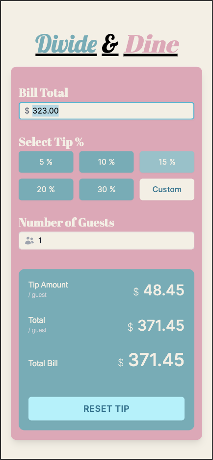

# Divide and Dine

## Overview
Divide and Dine is a simple, no-frills app designed to take the stress out of splitting restaurant bills. Whether you're dining with friends or coworkers, this tool quickly calculates each person's share based on the bill amount, tip percentage, and number of guests—all wrapped in a clean, old-school diner-themed UI.

## Try It Out
Check out the live version of Divide and Dine <a href="https://tiny-florentine-0677b3.netlify.app/" target="_blank">here</a>.

## Case Study
Learn more about the development process and insights behind Divide and Dine in the <a href="https://docs.google.com/document/d/1MLVxfwEqZ1opPeEcgMiea0KNxXbVOJd_Fv1Ee67j6tY/edit?usp=sharing" target="_blank">case study here</a>.

## Features
- **Effortless Bill Splitting**: Input the bill amount, tip percentage, and number of diners to instantly get per-person totals.
- **Minimalist Design**: Single-screen layout with a focus on usability and fewer clicks.
- **Retro Diner Vibe**: A fun, nostalgic theme that users love.

## Why Divide and Dine?
Tipping and splitting bills can be a hassle—mental math is tricky, and most apps are bloated with unnecessary features. Divide and Dine keeps it simple, targeting casual diners who want a fast, reliable solution without the clutter. Friends and family have praised its speed and ease, shaving minutes off the usual bill-splitting debates!

## Installation
1. Clone the repository: `git clone https://github.com/angelluis396/divide-and-dine.git`
2. Open the project in your preferred IDE.
3. Follow the setup instructions for your platform (e.g., Android, iOS, or web deployment).

## Usage
1. Enter the total bill amount.
2. Select or input a tip percentage.
3. Specify the number of guests.
4. Get instant per-person totals—no fuss, no extra steps.

## Future Improvements
- Add a pop-up number pad for mobile users (instead of a full keyboard).
- Explore additional themes or customization options.

## Contributing
Feedback and contributions are welcome! Feel free to submit a pull request or open an issue if you have ideas to enhance Divide and Dine.
